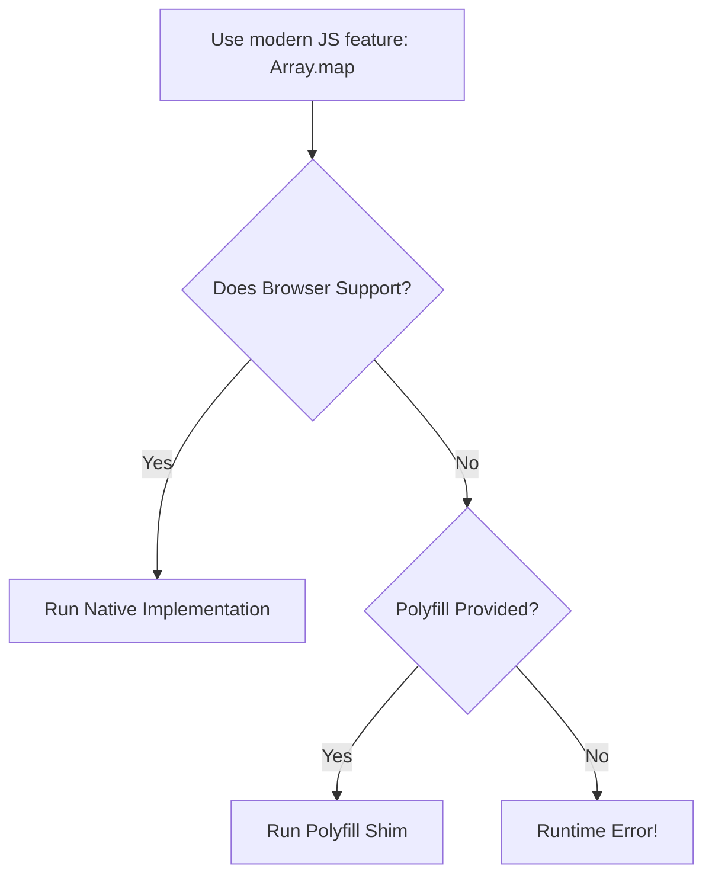

# 🛠️ JavaScript Polyfills

A **Polyfill** is a piece of code (usually JavaScript on the Web) used to provide modern functionality on older browsers that do not natively support it.

## 🧩 Why do we need Polyfills?

In technical interviews (like "Ace Frontend"), you're often asked to write your own versions of built-in methods to prove you understand they work under the hood.



---

## 🏗️ Example: Polyfill for `Array.map`

The `map` method returns a new array with the result of calling a function for every array element.

```javascript
Array.prototype.myMap = function(cb) {
    let temp = [];
    for (let i = 0; i < this.length; i++) {
        temp.push(cb(this[i], i, this));
    }
    return temp;
};
```

---

## 🚦 Common Polyfill Checklist

When writing a polyfill, keep these in mind:
1.  **Check for existence**: `if (!Array.prototype.map) { ... }`
2.  **Context (`this`)**: Ensure you're accessing the correct instance.
3.  **Return values**: Match the native method's signature exactly.
4.  **Arguments**: Handle extra arguments like `index` and the original `array`.

---

## 📂 Related Files in this Directory
- [/Map/](file:///c:/Users/USER/Desktop/100xBootcamp/100xDevs/Javascript/Ace-FE-Interview/Polyfills/Map/) - Detailed polyfill for Map.
- [/Intro/](file:///c:/Users/USER/Desktop/100xBootcamp/100xDevs/Javascript/Ace-FE-Interview/Polyfills/Intro/) - Conceptual introduction to polyfills.
- [/stringToObj/](file:///c:/Users/USER/Desktop/100xBootcamp/100xDevs/Javascript/Ace-FE-Interview/Polyfills/stringToObj/) - Custom object manipulation logic.
