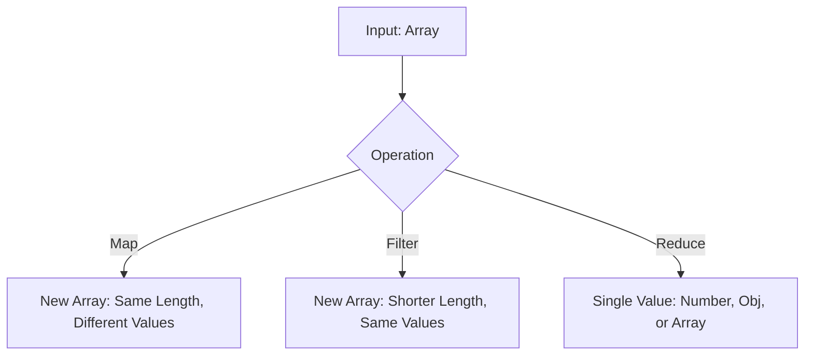
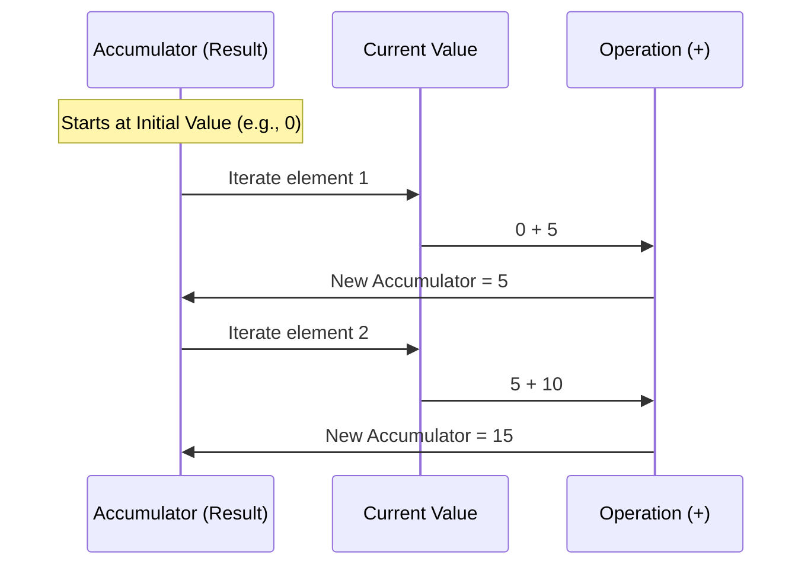

# 🔢 Array Methods in JavaScript

Arrays are one of the most powerful data structures in JavaScript. Modern JS developers use **Functional Programming** patterns to manipulate data efficiently.

## 🛠️ The Big Three: Map, Filter, Reduce

These methods are the foundation of clean, readable data transformation.

---

## 📋 Quick Comparison

| Method | Returns | Changes Input? | Typical Use Case |
| :--- | :--- | :--- | :--- |
| **`map()`** | New Array | No (Immutable) | Transforming data (e.g., doubling numbers). |
| **`filter()`** | New Array | No (Immutable) | Removing unwanted items. |
| **`reduce()`** | Single Value | No (Immutable) | Calculating sums, totals, or complex objects. |
| **`forEach()`** | `undefined` | Yes (Side Effects) | Just iterating (like a `for` loop). |

---

## 🧪 Diagram: The Reduce Flow

`Reduce` is often the hardest to grasp. It "squashes" an array into a single result using an **accumulator**.

---

## 🚩 Mutating vs Non-Mutating Methods

Be careful! Some methods change the original array (**In-Place**), while others return a copy (**Immutable**).

-   **Mutating (Avoid in React!)**: `push`, `pop`, `splice`, `reverse`, `sort`.
-   **Non-Mutating (Safe)**: `map`, `filter`, `slice`, `concat`, `reduce`.

---

## 📂 Related Files
- [Map-Filter-Reduce/](file:///c:/Users/USER/Desktop/100xBootcamp/100xDevs/Javascript/Map-Filter-Reduce/) - Deep dive into big-three.
- [ArrayMethods/](file:///c:/Users/USER/Desktop/100xBootcamp/100xDevs/Javascript/ArrayMethods/) - Basics like length, push, etc.
- [05-Slice.js](file:///c:/Users/USER/Desktop/100xBootcamp/100xDevs/Javascript/Rev-js/05-Slice.js) - Examples of slicing.
