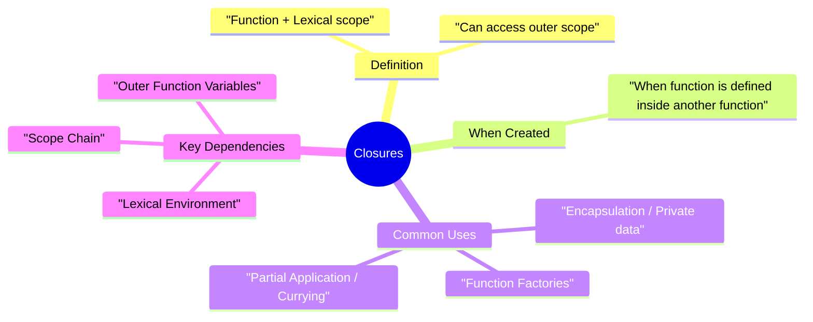

# 🔒 Closures in JavaScript

A **Closure** is the combination of a function bundled together (enclosed) with references to its surrounding state (the **lexical environment**).

## 🧩 The Core Concept

In simpler terms: A function **remembers** its birthplace, even if you call it from somewhere else.



---

## 🏗️ Lexical Scoping vs Closure

**Lexical Scoping** is the reason *why* closures are possible. It determines how variable names are resolved in nested functions.

```mermaid
graph TD
    subgraph Global Scope
    GS[Global Variables]
        subgraph Outer Function
        OF[Outer Variables]
            subgraph Inner Function
            IF[Inner Variables]
            end
        end
    end
    IF --> OF
    OF --> GS
    Note right of IF: Closure allows IF to access OF <br/> even after Outer Function has finished!
```

---

## 🧪 Example: Private Counter

One of the most powerful uses of closures is creating **private variables**.

```javascript
function createCounter() {
    let count = 0; // Private variable
    return {
        increment: function() { count++; return count; },
        decrement: function() { count--; return count; },
        getCount: function() { return count; }
    };
}
const counter = createCounter();
counter.increment(); // 1
console.log(counter.count); // undefined (Safe!)
```

---

## ⚡ The "Pitfall": Closures in Loops

When using `var` inside a loop with `setTimeout`, closures can behave unexpectedly because `var` is function-scoped.

```mermaid
sequenceDiagram
    participant Loop as For Loop (i=0 to 3)
    participant Stack as Call Stack
    participant WEB as Web APIs (setTimeout)
    participant MQ as Task Queue

    Loop->>WEB: setTimeout(func) - i=0
    Loop->>WEB: setTimeout(func) - i=1
    Loop->>WEB: setTimeout(func) - i=2
    Note over Loop: Loop finishes, i is now 3 (using var)
    WEB->>MQ: Push functions to queue
    MQ->>Stack: Execute function
    Note over Stack: Logs 3! (because i=3)
```

**Fix**: Use `let` (block scoped) or a self-invoking function (IIFE) to capture the value of `i` at each iteration.

---

## 📂 Related Files
- [17-closures.js](../Rev-js/17-closures.js) - Basic closure examples.
- [setTimeout+closures/](../setTimeout+closures/) - Detailed loop pitfalls.
