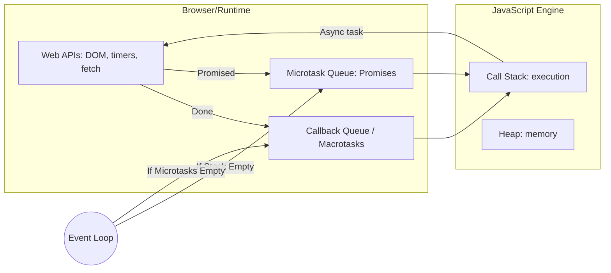

# 🎡 The JavaScript Event Loop

JavaScript is **single-threaded**, meaning it can only do one thing at a time. The **Event Loop** is the secret sauce that allows JavaScript to perform non-blocking I/O operations despite being single-threaded.

## 🏗️ The Architecture



---

## 🚦 Microtasks vs Macrotasks

Not all asynchronous tasks are created equal. The Event Loop prioritizes certain queues over others.

| Level | Task Type | Examples |
| :--- | :--- | :--- |
| **Highest** | **Microtasks** | `Promise.then/catch/finally`, `process.nextTick` (Node.js), `MutationObserver`. |
| **Lower** | **Macrotasks** | `setTimeout`, `setInterval`, `setImmediate`, I/O, UI rendering. |

### The "Loop" Process
1.  Execute code from the **Call Stack**.
2.  If the stack is empty, run **ALL** tasks in the **Microtask Queue**.
3.  If any microtasks spawn more microtasks, run those too (recursively!).
4.  Once Microtask Queue is empty, run **ONE** task from the **Macrotask Queue**.
5.  Repeat.

---

## 🧠 Brain Teaser

What is the output?
```javascript
console.log("Start");
setTimeout(() => console.log("Timeout"), 0);
Promise.resolve().then(() => console.log("Promise"));
console.log("End");
```

**Output**:
1. `Start` (Synchronous)
2. `End` (Synchronous)
3. `Promise` (Microtask - high priority)
4. `Timeout` (Macrotask - lower priority)

---

## 📂 Related Files
- [Event-loop/](./) - Core Event Loop concepts.
- [Callback/](../Callback/) - Introduction to asynchronous callbacks.
