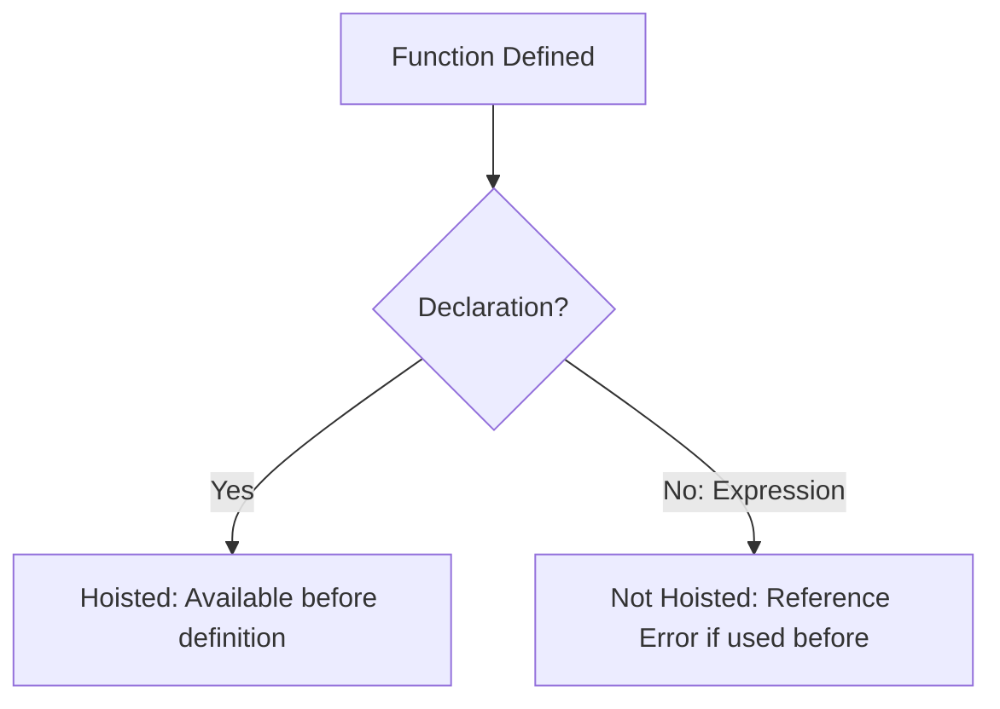

# 🏹 Functions: Declarations, Expressions, and Arrow Functions

JavaScript provides several ways to define functions, each with unique behaviors regarding **hoisting**, **this binding**, and **syntax**.

## 🏗️ 1. Function Declarations vs Expressions



### Examples
- **Declaration**: `function greet() { ... }` (Hoisted)
- **Expression**: `const greet = function() { ... }` (Not Hoisted)

---

## 🏹 2. Arrow Functions (ES6)

Arrow functions are a concise way to write functions, but they behave differently.

```mermaid
mindmap
  root((Arrow Functions))
    Syntax
      "Concise (a, b) => a + b"
      "Implicit Return (no braces)"
    this Binding
      "Lexical this"
      "Inherited from Parent Scope"
    Arguments Object
      "NO arguments object"
      "Use rest parameters ...args"
    Constructor
      "CANNOT be used with 'new'"
```

---

## 🚦 Comparison Table

| Feature | Function Declaration | Function Expression | Arrow Function |
| :--- | :--- | :--- | :--- |
| **Hoisting** | ✅ Yes | ❌ No | ❌ No |
| **`this` Binding** | 🧠 Dynamic (Call-site) | 🧠 Dynamic (Call-site) | 🎯 Lexical (Scope-based) |
| **Constructor** | ✅ Yes | ✅ Yes | ❌ No |
| **Implicit Return** | ❌ No | ❌ No | ✅ Yes |

---

## 🎯 When to use Arrow Functions?
-   **Always** for callbacks (like `map`, `filter`, `setTimeout`) to preserve `this`.
-   **Never** for object methods where you need to access other properties of that object using `this`.

### The `this` Pitfall
```javascript
const obj = {
    name: "Antigravity",
    regular: function() { console.log(this.name); },
    arrow: () => { console.log(this.name); }
};
obj.regular(); // "Antigravity"
obj.arrow();   // undefined (points to global scope!)
```

---

## 📂 Related Files
- [Function-ArrowFn/](file:///c:/Users/USER/Desktop/100xBootcamp/100xDevs/Javascript/Function-ArrowFn/) - Arrow function deep dive.
- [functionexpressions/](file:///c:/Users/USER/Desktop/100xBootcamp/100xDevs/Javascript/functionexpressions/) - Expression vs Declaration.
- [20-IIFE.js](file:///c:/Users/USER/Desktop/100xBootcamp/100xDevs/Javascript/Rev-js/20-IIFE.js) - Immediate execution.
