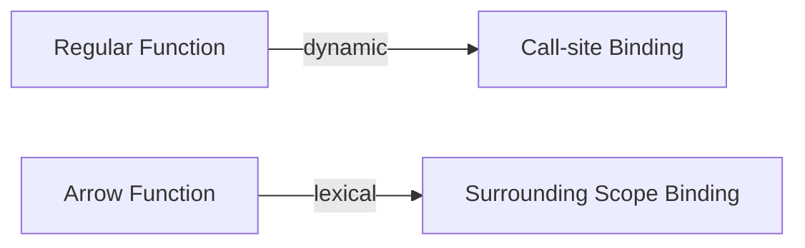

# 🧭 The `this` Keyword in JavaScript

The `this` keyword is one of the most confusing parts of JavaScript. It refers to the **object** that is currently executing the code. Its value is determined by **how a function is called**, not where it is defined.

## 🧠 The 5 Binding Rules

```mermaid
mindmap
  root((this Binding))
    Default
      "Standalone function call"
      "window (browser) or undefined (strict)"
    Implicit
      "Function called as a method"
      "obj.func()"
    Explicit
      "Using .call(), .apply(), or .bind()"
    New Binding
      "Using the 'new' keyword"
      "Points to the new object being created"
    Arrow Functions
      "Lexical this"
      "Inherits from surrounding scope"
```

---

## 🛠️ Comparison: `call`, `apply`, `bind`

These methods allow you to explicitly set the value of `this`.

| Method | Invocation | Parameters | Use Case |
| :--- | :--- | :--- | :--- |
| **`.call()`** | **Immediate** | Individual args: `(this, arg1, arg2)` | Borrowing methods. |
| **`.apply()`** | **Immediate** | Array of args: `(this, [args])` | Working with arrays (like Math.max). |
| **`.bind()`** | **Later** | Returns a new function | Event listeners, preserving context. |

---

## 🏹 Arrow Functions vs Regular Functions

Regular functions define their own `this` based on call-site. Arrow functions do **not** have their own `this`.



### The "Sticking" Point
If you use an arrow function inside a class method for a callback (like `setTimeout`), it will "correctly" point to the class instance because it inherits from the method's scope.

---

## 🚩 Common Pitfalls

1.  **Losing Context**: Passing an object method as a callback (e.g., to `addEventListener`) often loses the `this` binding.
2.  **Global Leak**: In non-strict mode, failing to bind `this` can accidentally attach variables to the global `window` object.

---

## 📂 Related Files in this Directory
- [This-Keyword/](./) - Deep dive examples.
- [03-call-apply-bind.js](../../Rev-js/03-call-apply-bind.js) - Exercises on explicit binding.
