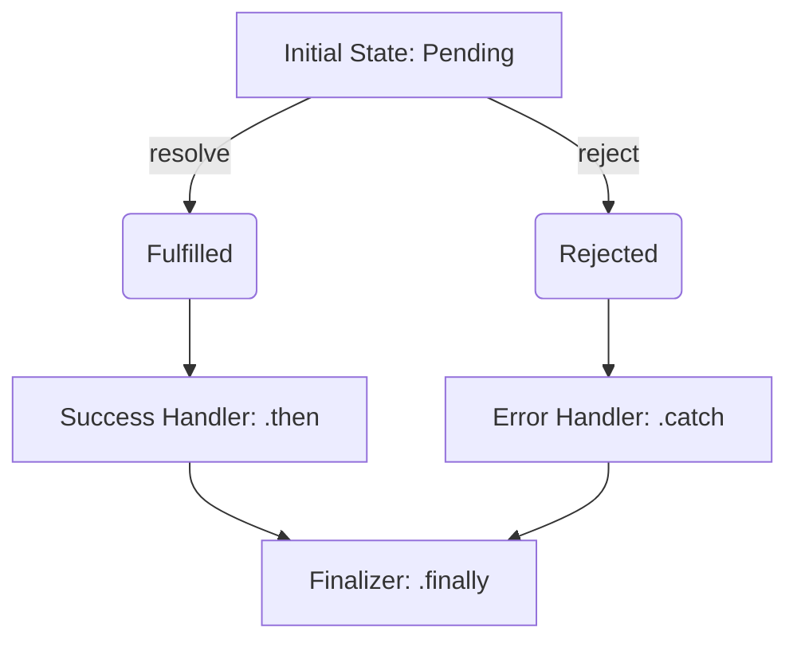
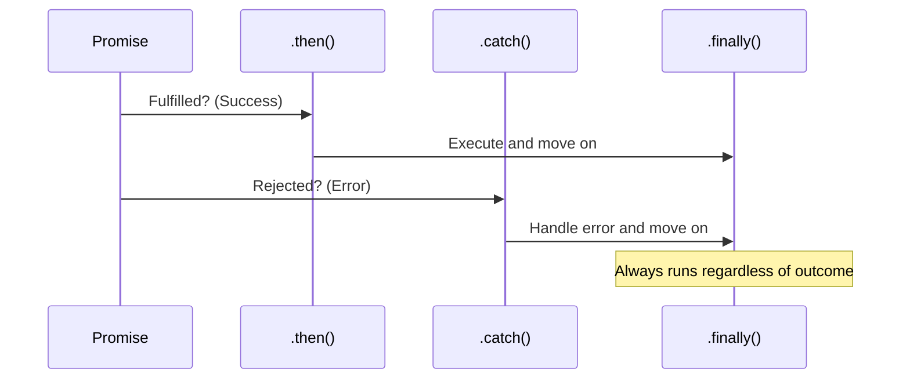

# 🤝 Promises in JavaScript

A **Promise** is an object representing the eventual completion (or failure) of an asynchronous operation and its resulting value.

## 🌈 The Promise Lifecycle

A Promise is always in one of three states:

1.  **Pending**: Initial state, neither fulfilled nor rejected.
2.  **Fulfilled**: The operation completed successfully.
3.  **Rejected**: The operation failed.



---

## ⛓️ Chaining Promises (`.then`, `.catch`, `.finally`)

Promises allow you to chain asynchronous operations, avoiding "Callback Hell".



---

## ⚡ Promise Static Methods (Combinators)

When dealing with multiple promises, JavaScript provides powerful static methods:

| Method | Description | Success Condition |
| :--- | :--- | :--- |
| **`Promise.all`** | Wait for **all** to fulfill or **any** to reject. | All must succeed. |
| **`Promise.allSettled`** | Wait for all to **settle** (either fulfill or reject). | Always waits for all. |
| **`Promise.race`** | Settle as soon as **any** promise settles. | First one wins. |
| **`Promise.any`** | Settle as soon as **any** promise fulfills. | First success wins. |

### Visual Comparison

```mermaid
graph LR
    subgraph Promise.all
    A1[P1] & A2[P2] & A3[P3] -->|All must succeed| AS[Success]
    A1 | A2 | A3 -->|Any fails| AF[Failure]
    end

    subgraph Promise.any
    B1[P1] & B2[P2] & B3[P3] -->|First success| BS[Success]
    B1 & B2 & B3 -->|All fail| BF[AggregateError]
    end
```

---

## 💡 Key Tips for Remembering
- **Promises are like real-life promises**: You say you'll do something. You're either working on it (**pending**), you did it (**fulfilled**), or you failed (**rejected**).
- **`.then()`** is for your "Happy Path".
- **`.catch()`** is your safety net.
- **`.finally()`** is for "Cleanup" (like closing a loading spinner).

---

## 📂 Related Files in this Directory
- [promise--core.js](file:///c:/Users/USER/Desktop/100xBootcamp/100xDevs/Javascript/Promises/promise--core.js) - Core syntax and basics.
- [promiseImplementation.js](file:///c:/Users/USER/Desktop/100xBootcamp/100xDevs/Javascript/Promises/promiseImplementation.js) - How to build your own Promise.
- [promise-all/](file:///c:/Users/USER/Desktop/100xBootcamp/100xDevs/Javascript/Promises/promise-all) - Deep dive into `Promise.all`.
