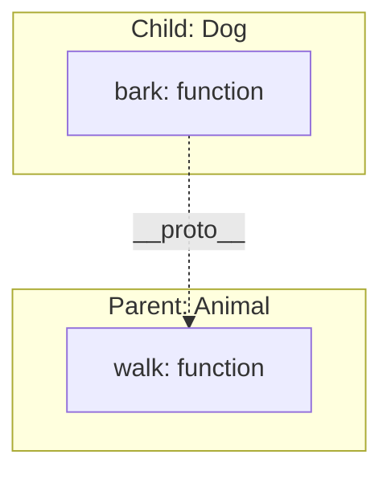
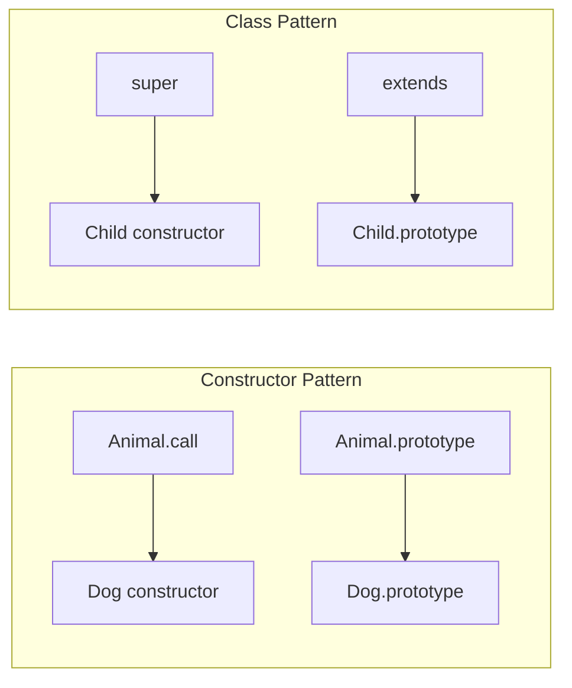

# 🏛️ Prototype Inheritance Deep Dive

In JavaScript, inheritance is not about copying blueprints (classes), but about **delegation** between objects via the Prototype Chain.

## 🔗 The Inheritance Model

When an object "inherits" from another, it simply holds a reference to that object. If a property is not found on the child, JavaScript looks up to the parent.



---

## 🏗️ 1. Constructor Function Inheritance (ES5 style)

Before classes, we used constructor functions and `Object.create()`.

```javascript
function Animal(name) {
    this.name = name;
}
Animal.prototype.eat = function() { console.log("Eating..."); };

function Dog(name, breed) {
    Animal.call(this, name); // Call super constructor
    this.breed = breed;
}
// Link prototypes
Dog.prototype = Object.create(Animal.prototype);
Dog.prototype.constructor = Dog;
```

---

## 💎 2. Modern Class Inheritance (ES6+)

Syntactic sugar over the prototype chain.

```javascript
class Animal {
    constructor(name) { this.name = name; }
    eat() { console.log("Eating..."); }
}

class Dog extends Animal {
    constructor(name, breed) {
        super(name); // Must call super()
        this.breed = breed;
    }
}
```

---

## 🧪 Diagram: Constructor vs Class Relationship



---

## 📂 Related Files
- [PI1.js](file:///c:/Users/USER/Desktop/100xBootcamp/100xDevs/Javascript/PrototypeInheritance/PI1.js) - Basic inheritance scripts.
- [PI2.js](file:///c:/Users/USER/Desktop/100xBootcamp/100xDevs/Javascript/PrototypeInheritance/PI2.js) - Advanced patterns.
- [02-prototype-chain.js](file:///c:/Users/USER/Desktop/100xBootcamp/100xDevs/Javascript/Rev-js/02-prototype-chain.js) - Revision examples.
