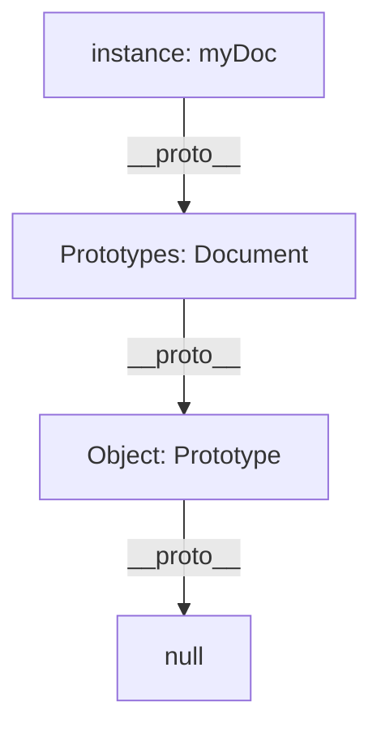

# 🧬 Prototypes and Inheritance in JavaScript

JavaScript is a **prototype-based** language. Every object has a link to another object called its **Prototype**. This link forms a chain that JavaScript uses to find properties and methods.

## 🔗 The Prototype Chain



When you try to access a property:
1.  Check the **Object** itself.
2.  Check its **Prototype**.
3.  Check the **Prototype's Prototype**.
4.  Stop if you reach `null`.

---

## 🏗️ `[[Prototype]]` vs `.prototype`

This is the most common confusion in JS:

-   **`[[Prototype]]` (or `__proto__`)**: The actual link in an **instance** pointing to its prototype.
-   **`.prototype`**: A property only **constructor functions** (and classes) have. It is used as the blueprint for objects created with `new`.

```mermaid
graph LR
    subgraph Constructor
    F[Function: Person]
    P[Person.prototype]
    end

    subgraph Instance
    I[const me = new Person()]
    end

    F -- "defines" --> P
    I -- "__proto__" --> P
```

---

## 🏛️ Prototypal Inheritance

Inheritance in JS is just one object "borrowing" from another.

```mermaid
mindmap
  root((Inheritance))
    Classical
      "Classes are blueprints"
      "Copies structure"
    Prototypal
      "Objects are live instances"
      "Links to existing objects"
      "Saves Memory (functions aren't copied)"
```

### Pro Tip for Memory
Always put methods on the `.prototype` instead of inside the constructor.
- **Bad**: `this.greet = () => {}` (Created for every instance)
- **Good**: `Person.prototype.greet = () => {}` (Created once, shared by all)

---

## 📂 Related Files
- [Prototypes/](file:///c:/Users/USER/Desktop/100xBootcamp/100xDevs/Javascript/Prototypes/) - Basics of prototype links.
- [PrototypeInheritance/](file:///c:/Users/USER/Desktop/100xBootcamp/100xDevs/Javascript/PrototypeInheritance/) - Complex inheritance patterns.
- [02-prototype-chain.js](file:///c:/Users/USER/Desktop/100xBootcamp/100xDevs/Javascript/Rev-js/02-prototype-chain.js) - Script examples.
