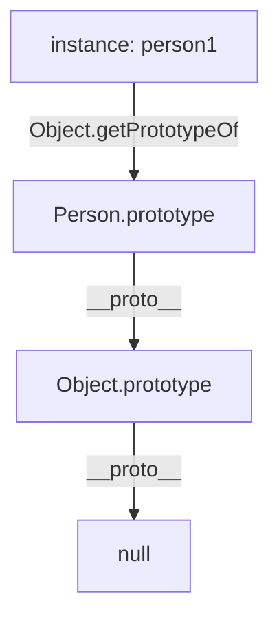

# 🔗 Prototype Chain

The **Prototype Chain** is a series of links between objects that JavaScript uses to look up properties and methods.

## 🧬 How it works

When you access a property on an object, JavaScript:
1.  Looks at the object itself.
2.  If not found, looks at its **Prototype** (`[[Prototype]]`).
3.  Continue up the chain until it finds the property or reaches `null`.



### 🔍 Checking the Prototype
You can check an object's prototype using `Object.getPrototypeOf(obj)` or the deprecated `__proto__` property.

```javascript
const person1 = new Person();
console.log(Object.getPrototypeOf(person1)); // Person.prototype
```

---

## 📂 Code Example
- [02-prototype-chain.js](./02-prototype-chain.js)
