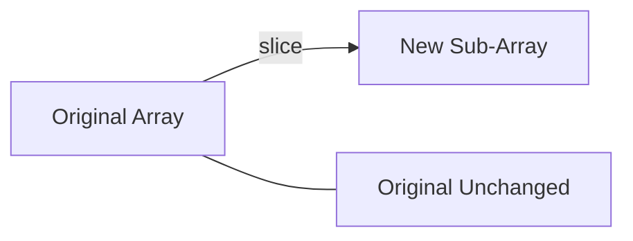

# 🔪 Array.prototype.slice()

The `slice()` method returns a **shallow copy** of a portion of an array into a new array object.

## ⚖️ Key Characteristics
- **Non-Mutating**: It does **not** change the original array.
- **Indices**: Takes `(start, end)`. The `end` index is **not inclusive**.
- **Negative Indices**: Can take negative values to offset from the end of the array.



## 📋 Examples

```javascript
[1, 2, 3, 4, 5].slice(1, 3); // [2, 3]
[1, 2, 3, 4, 5].slice(2);    // [3, 4, 5]
[1, 2, 3, 4, 5].slice(-2);   // [4, 5] (Last 2 elements)
```

---

## 📂 Code Example
- [05-Slice.js](./05-Slice.js)
