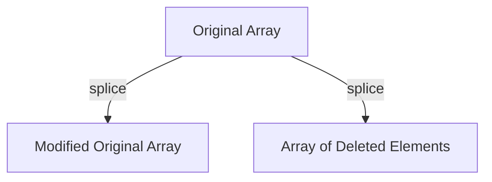

# ✂️ Array.prototype.splice()

The `splice()` method changes the contents of an array by removing or replacing existing elements and/or adding new elements **in place**.

## ⚖️ Key Characteristics
- **Mutating**: It **modifies** the original array.
- **Returns**: An array containing the deleted elements.
- **Parameters**: `(start, deleteCount, item1, item2, ...)`

## 📋 Usage
- **Removing**: `arr.splice(index, count)`
- **Adding**: `arr.splice(index, 0, newItem1, newItem2)`
- **Replacing**: `arr.splice(index, count, newItem)`

---

## 📂 Code Example
- [06-splice.js](./06-splice.js)
