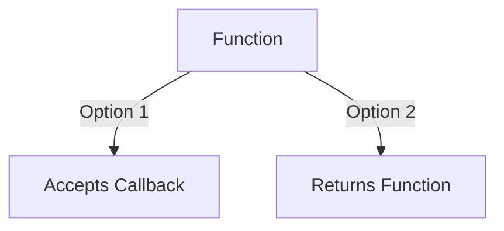

# ⚡ Higher-Order Functions (HOF)

A **Higher-Order Function** is a function that does at least one of the following:
1.  Takes one or more functions as arguments (callbacks).
2.  Returns a function as its result.

## 🏗️ Structure



### 📋 Example: Callback Pattern
```javascript
const higherOrder = (callback) => {
    console.log("Executing HOF...");
    callback();
};

higherOrder(() => console.log("I am the callback!"));
```

---

## 📂 Code Example
- [13-higerOrderFun.js](./13-higerOrderFun.js)
