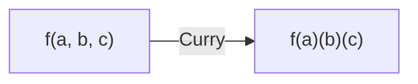

# 🍛 Currying

**Currying** is the process of transforming a function that takes multiple arguments into a sequence of functions that each take a single argument.

## 🔄 Transformation



### 📋 Example
```javascript
// Multi-argument function
const add = (a, b, c) => a + b + c;

// Curried version
const curriedAdd = (a) => (b) => (c) => a + b + c;

console.log(curriedAdd(1)(2)(3)); // 6
```

---

## 📂 Code Example
- [15-currying.js](./15-currying.js)
