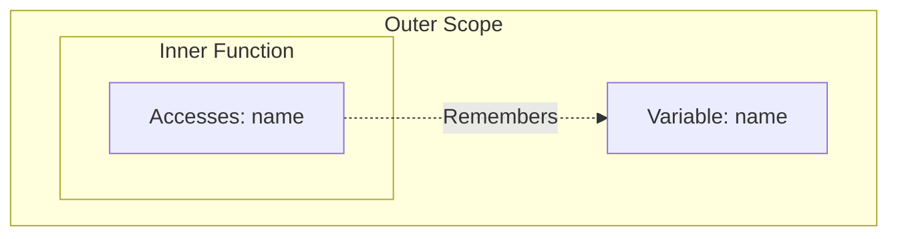

# 🔒 Closures (Quick Rev)

A **Closure** is a function that remembers its lexical environment even when it's executed outside that scope.

## 🏗️ Structure



### 📋 Example
```javascript
function welcome(name) {
    return function() {
        return `Welcome ${name}`; // Accesses name via closure
    };
}
```

---

## 📂 Code Example
- [17-closures.js](./17-closures.js)
