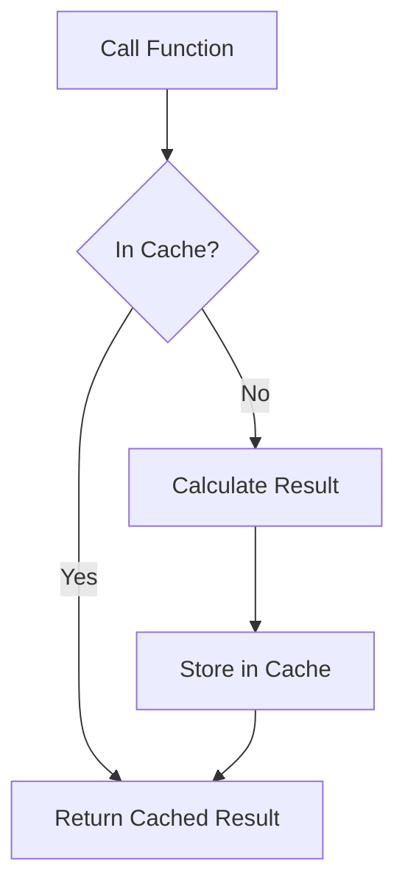

# 🧠 Memoization

**Memoization** is an optimization technique used to speed up programs by storing the results of expensive function calls and returning the cached result when the same inputs occur again.

## 🔄 The Logic

### 📋 Key Components
- **Cache Object**: Usually a JS object or Map to store `input -> output` pairs.
- **Closure**: To keep the cache persistent across multiple function calls.

---

## 📂 Code Example
- [25-memoization.js](./25-memoization.js)
