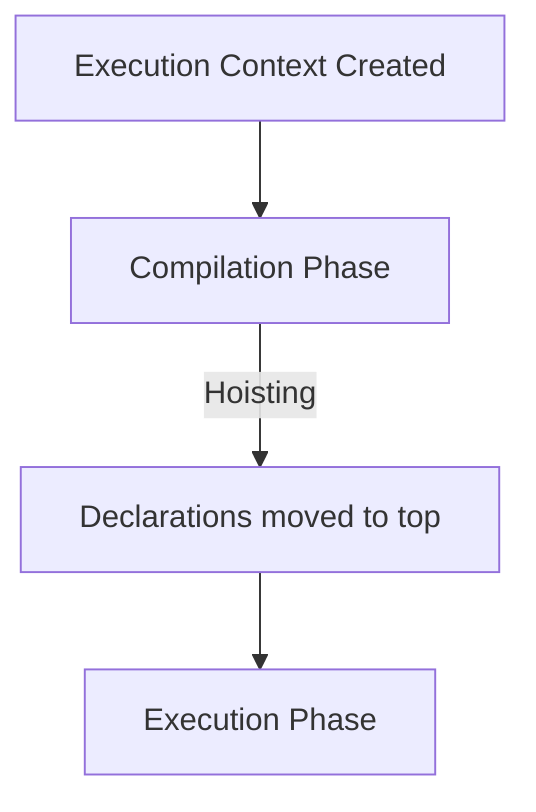

# 🚀 Hoisting

**Hoisting** is the behavior where variable and function declarations are moved to the top of their containing scope during the compilation phase.

## 🏗️ Hoisting Rules

| Type | Hoisted? | Initialized? |
| :--- | :--- | :--- |
| **`var`** | ✅ Yes | `undefined` |
| **`function`** | ✅ Yes | **Full function definition** |
| **`let / const`** | ✅ Yes | **Uninitialized (TDZ)** |

---

## 📂 Code Example
- [26-hoisting.js](./26-hoisting.js)
