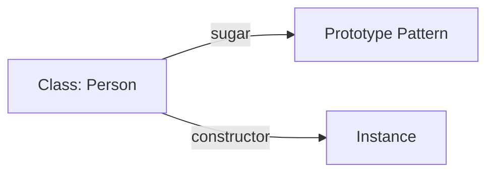
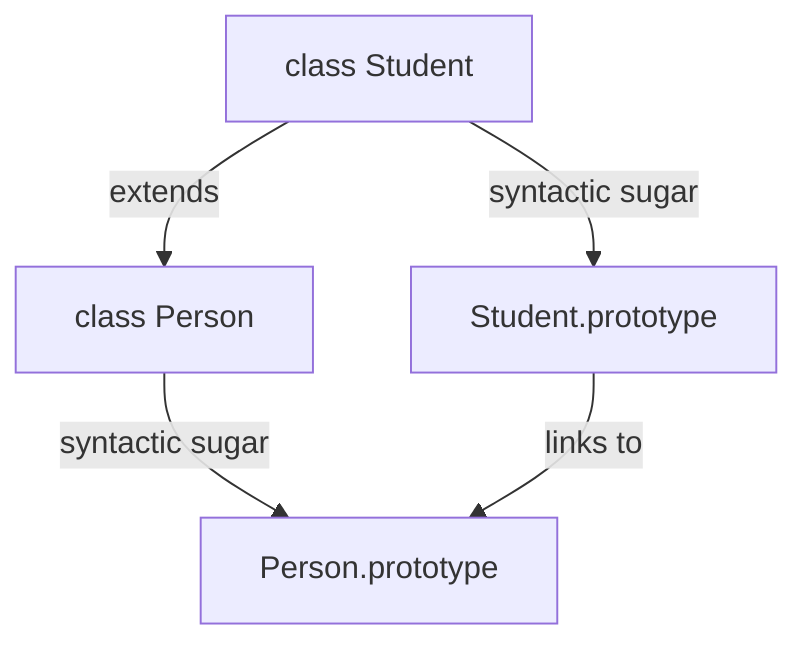

# 🏛️ ES6 Classes

In ES6, JavaScript classes were introduced as **syntactic sugar** over the existing prototype-based inheritance. They don't introduce a new object-oriented inheritance model but provide a much cleaner and more familiar syntax for creating objects and dealing with inheritance.

## 🏗️ Key Features

- **Class Declaration**: `class Person { ... }`
- **Constructor**: A special method for creating and initializing an object created with a class.
- **Methods**: Functions defined inside the class (shorthand syntax).

## ⚖️ Class vs Prototype

While they look like "Classes" from Java or C++, they are still prototypes under the hood.

---

## 📂 Code Example
- [27-classes.js](./27-classes.js)
