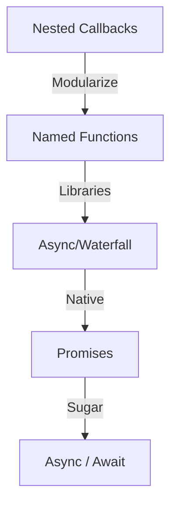

# 🕸️ Avoiding Callback Hell

"Callback Hell" or the "Pyramid of Doom" occurs when multiple asynchronous operations are nested, making the code hard to read, maintain, and debug.

## 🚦 Evolutionary Path

## 🛠️ Solutions

### 1. Modularization
Extract nested callbacks into named functions to flatten the structure.

### 2. Promises & Async/Await
The modern standard. Allows for linear, readable code that looks synchronous but performs asynchronously.

### 3. Flow Control Libraries
Libraries like `async` (using `waterfall` or `series`) help manage complex dependency chains.

---

## 📂 Code Example
- [28-avoid-callback.js](./28-avoid-callback.js)
