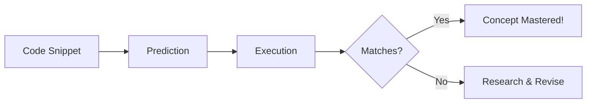

# 🧩 Output-based JS Challenges

This directory contains a series of problems designed to test your understanding of JavaScript's quirky behaviors, scoping, and execution order.

## 🧪 What's inside?

- Scoping challenges with `var`, `let`, and `const`.
- `this` binding puzzles.
- Asynchronous execution order (Event Loop).
- Prototype chain lookups.

---

## 📂 Challenges
- [02-prob.js](./02-prob.js)
- [03-prob.js](./03-prob.js)
- ... and more.
