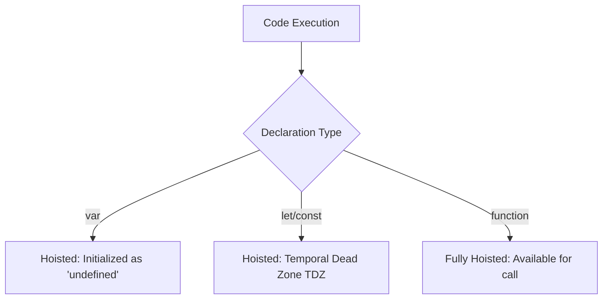
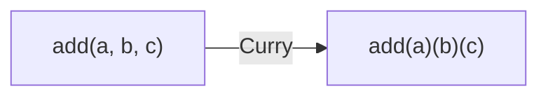
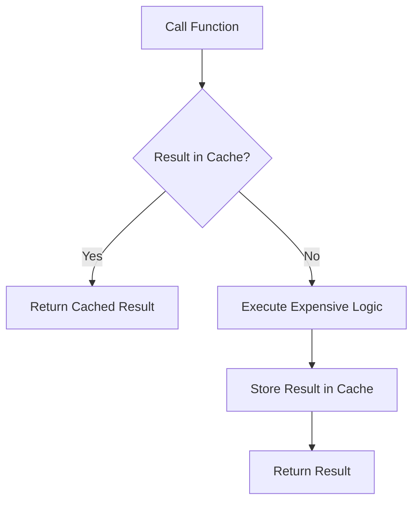

# 🚀 JavaScript Revision Quick Guide (`Rev-js`)

This directory contains a collection of core JavaScript concepts essential for interviews and deep understanding.

## 🏗️ Hoisting

**Hoisting** is JavaScript's default behavior of moving declarations to the top of the current scope.



- **TDZ (Temporal Dead Zone)**: The period between entering a scope and the variable being declared where accessing it throws a `ReferenceError`.

---

## ⚡ Higher Order Functions (HOF)

A **Higher Order Function** is a function that either:
1.  Takes a function as an argument.
2.  Returns a function.

```javascript
function multiplier(factor) {
    return function(num) {
        return num * factor;
    };
}
const double = multiplier(2); // double is a function
```

---

## 🍛 Currying

**Currying** is a technique of transforming a function that takes multiple arguments into a sequence of functions that each take a single argument.



**Why use it?**
-   Helps in creating reusable functions (Partial Application).
-   Clean and maintainable code for configuration.

---

## 🔒 IIFE (Immediately Invoked Function Expression)

An IIFE is a function that runs as soon as it is defined.

```javascript
(function() {
    console.log("I run immediately!");
})();
```

**Use Case**: Avoiding global scope pollution and creating private variables (pre-ES6 modules).

---

## 🧠 Memoization

A technique to speed up programs by storing the results of expensive function calls and returning the cached result when the same inputs occur again.



---

## 📂 Key Files
- [13-higerOrderFun.js](file:///c:/Users/USER/Desktop/100xBootcamp/100xDevs/Javascript/Rev-js/13-higerOrderFun.js) - HOF examples.
- [15-currying.js](file:///c:/Users/USER/Desktop/100xBootcamp/100xDevs/Javascript/Rev-js/15-currying.js) - Currying scripts.
- [26-hoisting.js](file:///c:/Users/USER/Desktop/100xBootcamp/100xDevs/Javascript/Rev-js/26-hoisting.js) - Hoisting pitfalls.
- [25-memoization.js](file:///c:/Users/USER/Desktop/100xBootcamp/100xDevs/Javascript/Rev-js/25-memoization.js) - Implementation of memoization.
