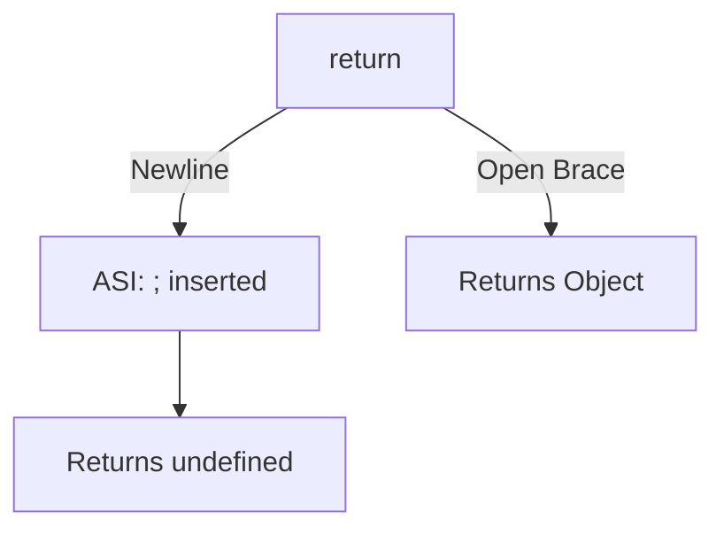

# 🏁 Automatic Semicolon Insertion (ASI)

JavaScript has a mechanism called **ASI** where it automatically adds semicolons where it thinks they are missing. This can sometimes lead to unexpected bugs.

## 🚩 The `return` Pitfall

A common issue occurs when you place a newline immediately after a `return` statement. ASI will insert a semicolon, causing the function to return `undefined` instead of the intended object.

```javascript
// ❌ WRONG
function foo() {
    return  // ASI inserts ';' here!
    {
        message: "Hello"
    };
}

// ✅ RIGHT
function foo() {
    return {
        message: "Hello"
    };
}
```



---

## 📂 Code Example
- [semicolon-issue.js](./semicolon-issue.js)
