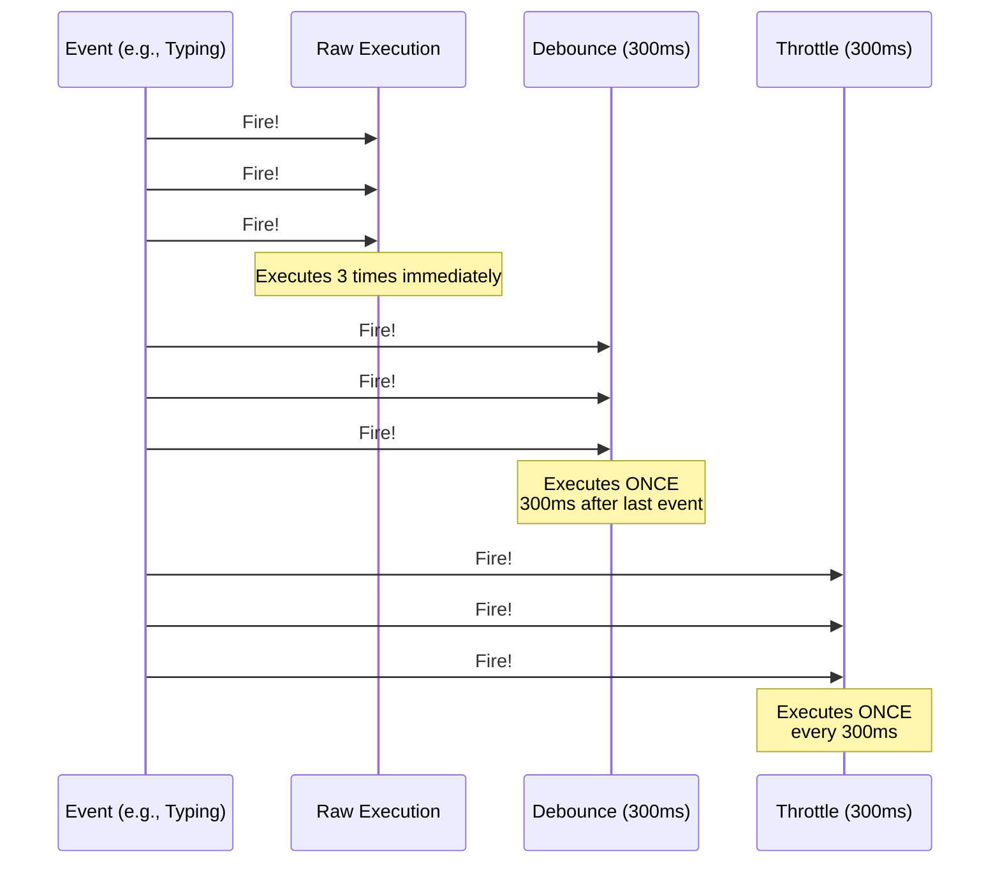

# ⏱️ Throttling and Debouncing

Both **Throttling** and **Debouncing** are techniques used to limit the number of times a function is executed over a period of time. This is essential for performance-heavy events like `resize`, `scroll`, and `keyups`.

## 📈 Visual Comparison



---

## 🛑 1. Debouncing
**"Wait until I'm done!"**
Debouncing ensures that a function is only called after a certain amount of time has passed since the last time it was invoked.

**Use Case**: Type-ahead search (don't search on every keystroke, wait for the user to stop typing).

```javascript
function debounce(func, delay) {
    let timer;
    return (...args) => {
        clearTimeout(timer);
        timer = setTimeout(() => func.apply(this, args), delay);
    };
}
```

---

## 🌊 2. Throttling
**"Only once every X ms!"**
Throttling ensures that a function is called at most once in a specified time interval.

**Use Case**: Scroll events (update the UI every 100ms, not every single pixel scrolled).

```javascript
function throttle(func, limit) {
    let inThrottle;
    return (...args) => {
        if (!inThrottle) {
            func.apply(this, args);
            inThrottle = true;
            setTimeout(() => inThrottle = false, limit);
        }
    };
}
```

---

## 📂 Related Files
- [throttling.js](./throttling.js) - Basic implementation.
- [Ace-FE-Interview/Debouncing/](../Ace-FE-Interview/Debouncing/) - Interview prep for debouncing.
